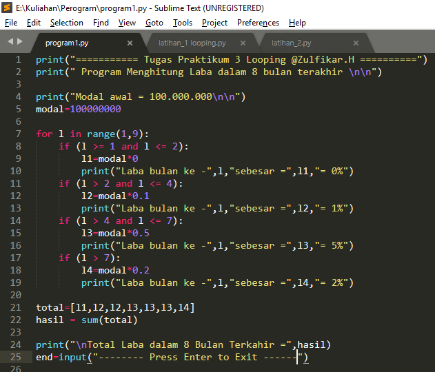

# Latihan 1

------------

**o Program untuk menghasilkan bilangan random di bawah 0.5**

**o Mengunakan Kombinasi For dan WHile**

------------

## Flowchart
[]

------------

## Source code
]

------------

## Hasil Screen Shoot
]
------------

### 

# Latihan 2

------------

**o Mencari BIlangan besardari bilangan n yang di input**

**o Berhenti jika kita memasukan angka 0**

------------

## Flowchart
[]

------------

## Source code
]

------------

## Hasil Screen Shoot
]
------------
### 

#Program1.py
------------

##Skema
- Seorang pengusaha menginvestasikan uangnya untuk memulai usahanya dengan modal awal 100 juta, pada bulan pertama dan kedua belum mendapatkan laba, pada bulan ketiga baru mulai mendapatkan laba sebesar 1% dan pada bulan kelima, pendapatan meningkat 5%, selanjutnya pada bulan ke8 mengalami penurunan keuntungan sebesar 2%, sehingga laba menjadi 3%.

------------

## Flowchart
[]

------------

## Source code
]

------------

## Hasil Screen Shoot
]
------------
### 
